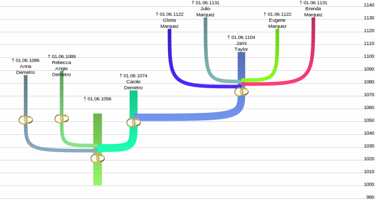

# life_line_chart
Generate ancestor and descendants (genealogy) chart. SVG export is supported.

## Getting started

Install the module and the requiredments. Open a gedcom file and generate a ancestor life line chart.

### Prerequisites

You will need a gedcom file. You can use the automatically generated one from the tests directory in this repository ([tests/autogenerated.ged]).

```python
from life_line_chart import DescendantChart, AncestorChart
from life_line_chart.GedcomInstanceContainer import get_gedcom_instance_container
individual_id = '@I249@'
chart = AncestorChart(
    instance_container=get_gedcom_instance_container(
        'tests/autogenerated.ged'),
    formatting={'total_height': 800, 'horizontal_step_size':20}
)
chart.set_chart_configuration({'root_individuals': [
    {'individual_id': individual_id, 'generations': 8}
]})
chart.update_chart()
chart.paint_and_save('example_1.svg')


individual_id = '@I2@'
chart = DescendantChart(
    instance_container=get_gedcom_instance_container(
        'tests/autogenerated.ged'),
    formatting={
        'total_height': 400,
        'horizontal_step_size':70,
        'relative_line_thickness':0.2}
)
chart.set_chart_configuration({'root_individuals': [
    {'individual_id': individual_id, 'generations': 2}
]})
chart.update_chart()
chart.paint_and_save('example_2.svg')


individual_id = '@I2@'
chart = DescendantChart(
    instance_container=get_gedcom_instance_container(
        'tests/autogenerated.ged'),
    positioning={
        'chart_layout': 'cactus'
    },
    formatting={
        'total_height': 400,
        'birth_label_active': False,
        'death_label_letter_y_offset': -3,
        'line_weighting': 'number_of_descendants',
        'horizontal_step_size':70,
        'relative_line_thickness':0.2}
)
chart.set_chart_configuration({'root_individuals': [
    {'individual_id': individual_id, 'generations': 3}
]})
chart.update_chart()
chart.paint_and_save('example_3.svg')
```





### Installing

[requirements.txt](requirements.txt)

Then you will need the following modules:
- svgwrite (i.e. pyparsing)
- pillow (for tests with photos)

```
pip install -r requirements.txt
```

### Building

```
python setup.py bdist_wheel
```

Automatically generating example gedcom files requires the module
- names

Building a wheel requires with setup.py requires:
- shutil
- glob
- setuptools
- distutils
- wheel

## License

This project is licensed under the MIT License - see the [LICENSE](LICENSE) file for details

<!-- ## Acknowledgments

* Hat tip to anyone whose code was used
* Inspiration
* etc -->
