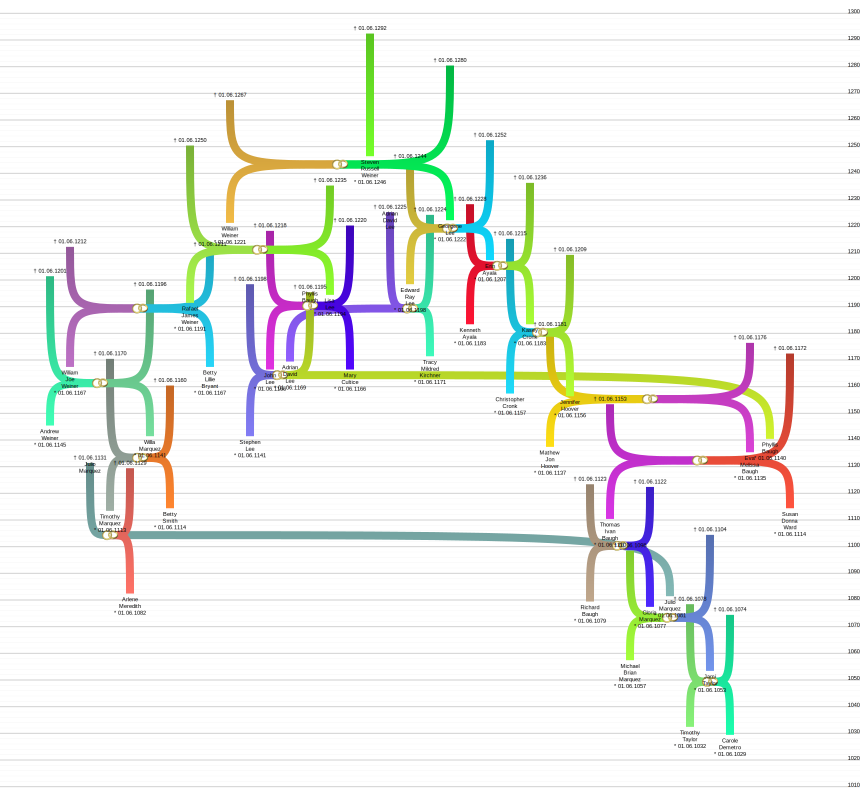

# life_line_chart
Generate ancestor (genealogy) chart. SVG export is supported.

## Getting started

Install the module and the requiredments. Open a gedcom file and generate a ancestor life line chart.

### Prerequisites

You will need a gedcom file. You can use the automatically generated one from the tests directory in this repository ([tests/autogenerated.ged]).

```python
from life_line_chart import AncestorGraph, get_gedcom_instance_container
individual_id = '@I249@'
graph = AncestorGraph(
        instance_container=lambda : get_gedcom_instance_container('tests/autogenerated.ged'), 
        formatting={'total_height':800}
    )
graph.select_individuals(
        graph._instances[('i', individual_id)],
        generations = 8
    )
graph.place_selected_individuals(
        graph._instances[('i',individual_id)],
        None,
        None,
        None,
        0
    )
graph.define_svg_items()
graph.paint_and_save(individual_id, 'example_1.svg')
```




### Installing

[requirements.txt](requirements.txt)

Then you will need the following modules:
- svgwrite
- svgpathtools
- numpy
- pillow
- python-dateutil

```
pip install -r requirements.txt
```

### Building

```
python setup.py bdist_wheel
```

Automatically generating example gedcom files requires the module
- names

Building a wheel requires with setup.py requires:
- shutil
- glob
- setuptools
- distutils
- wheel

## License

This project is licensed under the MIT License - see the [LICENSE](LICENSE) file for details

<!-- ## Acknowledgments

* Hat tip to anyone whose code was used
* Inspiration
* etc -->
